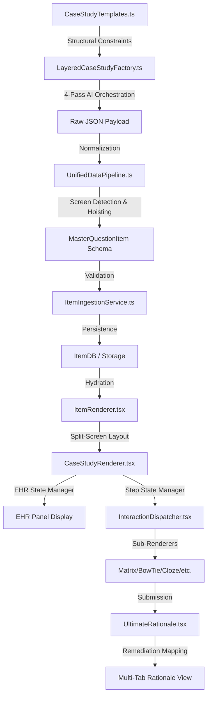

# MASTER CASE STUDY PROTOCOL (v1.0.0)
> SINGLE SOURCE OF TRUTH FOR DATA MAPPING & STRUCTURE

## ⚠️ SCHEMA ENFORCEMENT & COMPLIANCE
As of v1.0.0, ALL items are subjected to the Unified Data Pipeline (UDP) which enforces:
1. **ID Sanitization**: Stripping trailing commas and whitespace.
2. **JSON Revival**: Automatic parsing of double-encoded JSON strings in metadata.
3. **Ajv Validation**: Final gatekeeper validation against `MasterQuestionItem.schema.json`.

ALL renderers MUST assume sanitized data. Do not manually clean data in the rendering layer; add guard clauses instead. This document defines the strict schema, labeling, and architectural requirements for the NGN Case Study system. All Generation passes, Data Pipelines, and UI Renderers MUST adhere to these exact keys and associations.

## 1. System Architecture Map
The Case Study lifecycle is governed by the following interconnected systems:

## 2. Pedagogical Logic (The NCLEX CJMM)
The Case Study follows the 6-step Clinical Judgment Measurement Model (CJMM). Every generation MUST follow this sequencing:

| Screen # | CJMM Phase | Cognitive Task |
| :--- | :--- | :--- |
| **1** | **Recognize Cues** | Identify relevant vs. irrelevant data from the H&P/Notes. |
| **2** | **Analyze Cues** | Connect cues to potential pathologies. |
| **3** | **Prioritize Hypotheses** | Determine the most likely/urgent condition. |
| **4** | **Generate Solutions** | Identify expected outcomes and interventions. |
| **5** | **Take Action** | Select the best nursing interventions/treatments. |
| **6** | **Evaluate Outcomes** | Assess the patient's response to the interventions. |

## 3. Scoring Models & Data Requirements
NGN items use specialized scoring models. The AI Factory MUST output the correct schema for each:

| Scoring Type | NGN Item Mapping | JSON Schema Requirement |
| :--- | :--- | :--- |
| **0/1 Scoring** | Multiple Choice / Highlights | Single target per item. |
| **+/- Scoring** | Multiple Response (SATA) | Support for partial credit and penalties. |
| **Rationale Scoring** | Dyads / Triads | Linked logic (e.g., "If X because of Y"). |
| **Matrix Scoring** | Matrix Grid | Individual row/column scoring keys. |

## 4. System File Directory (Plumbing)

### A. Core Services (Generation & Logic)
| File | Role | Clinical Requirement |
| :--- | :--- | :--- |
| **[LayeredCaseStudyFactory.ts](file:///c:/Users/USER/OneDrive/Desktop/MASTER%20NGN%20GENERATOR-20251218T130148Z-3-001/MASTER%20NGN%20GENERATOR/src/services/LayeredCaseStudyFactory.ts)** | Orchestrator | Executes the 4-Pass Clinical Pipeline. |
| **[CaseStudyTemplates.ts](file:///c:/Users/USER/OneDrive/Desktop/MASTER%20NGN%20GENERATOR-20251218T130148Z-3-001/MASTER%20NGN%20GENERATOR/src/services/CaseStudyTemplates.ts)** | Structural Source | Defines screen counts and distractor ratios. |

### B. Ingestion & Schemas (Integration)
| File | Role | Structural Requirement |
| :--- | :--- | :--- |
| **[UnifiedDataPipeline.ts](file:///c:/Users/USER/OneDrive/Desktop/MASTER%20NGN%20GENERATOR-20251218T130148Z-3-001/MASTER%20NGN%20GENERATOR/src/services/UnifiedDataPipeline.ts)** | Normalizer | Hoists `screens` and `clinicalData` for the renderer. |
| **[ItemIngestionService.ts](file:///c:/Users/USER/OneDrive/Desktop/MASTER%20NGN%20GENERATOR-20251218T130148Z-3-001/MASTER%20NGN%20GENERATOR/src/services/ingestion/ItemIngestionService.ts)** | Validator | Ensures "Nurses Notes" and "Labs" are presence. |

### C. Rendering System (Display & Analytics)
| File | Role | UI/Data Requirement |
| :--- | :--- | :--- |
| **[CaseStudyRenderer.tsx](file:///c:/Users/USER/OneDrive/Desktop/MASTER%20NGN%20GENERATOR-20251218T130148Z-3-001/MASTER%20NGN%20GENERATOR/src/components/item-types/renderers/CaseStudyRenderer.tsx)** | Layout | Standard EHR UI Labels: Nurses Notes, Laboratory Results, etc. |
| **[UltimateRationale.tsx](file:///c:/Users/USER/OneDrive/Desktop/MASTER%20NGN%20GENERATOR-20251218T130148Z-3-001/MASTER%20NGN%20GENERATOR/src/components/UltimateRationale.tsx)** | Rationale | Standard Tab Labels: Option Review, Clinical Logic, Strategy, Knowledge. |
| **[analyticsService.ts](file:///c:/Users/USER/OneDrive/Desktop/MASTER%20NGN%20GENERATOR-20251218T130148Z-3-001/MASTER%20NGN%20GENERATOR/src/services/analyticsService.ts)** | Tracking | Tracks performance by CJMM Step (1-6) across the case. |

## 5. EHR Data Key Mapping (UI -> JSON)
| UI Label | JSON Key Path | Rule |
| :--- | :--- | :--- |
| **History & Physical** | `clinicalData.historyPhysical` | Markdown |
| **Nurses Notes** | `clinicalData.history` | Array<{time, note}> |
| **Vital Signs** | `clinicalData.vitals` | Array<{time, bp...}> |
| **Laboratory Results**| `clinicalData.labs` | Array<{test, value}> |
| **Orders** | `clinicalData.orders` | Array<{drug, dose}> |
| **Radiology** | `clinicalData.radiology` | Array<{study, findings}> |

## 7. End-to-End Lifecycle (Prompt to Admin Panel)
This section maps the complete journey of a Case Study item. Every file listed is a critical dependency.

### A. Generation Phase (The Factory)
- **Prompt Source**: [case-study-perfect-v3.md](file:///c:/Users/USER/OneDrive/Desktop/MASTER%20NGN%20GENERATOR-20251218T130148Z-3-001/MASTER%20NGN%20GENERATOR/src/prompts/case-study-perfect-v3.md) (Contains the 4-pass clinical logic instructions).
- **Templates**: [CaseStudyTemplates.ts](file:///c:/Users/USER/OneDrive/Desktop/MASTER%20NGN%20GENERATOR-20251218T130148Z-3-001/MASTER%20NGN%20GENERATOR/src/services/CaseStudyTemplates.ts) (Hardcoded difficulty & structural rules).
- **Service**: [LayeredCaseStudyFactory.ts](file:///c:/Users/USER/OneDrive/Desktop/MASTER%20NGN%20GENERATOR-20251218T130148Z-3-001/MASTER%20NGN%20GENERATOR/src/services/LayeredCaseStudyFactory.ts) (Orchestrates the 4 AI calls).
- **Creation UI**: [LayeredCaseStudyWizard.tsx](file:///c:/Users/USER/OneDrive/Desktop/MASTER%20NGN%20GENERATOR-20251218T130148Z-3-001/MASTER%20NGN%20GENERATOR/src/components/wizards/LayeredCaseStudyWizard.tsx) (The wizard interface used by admins).

### B. Validation & Storage Phase (The Ingestion)
- **Ingestion**: [ItemIngestionService.ts](file:///c:/Users/USER/OneDrive/Desktop/MASTER%20NGN%20GENERATOR-20251218T130148Z-3-001/MASTER%20NGN%20GENERATOR/src/services/ingestion/ItemIngestionService.ts) (Validates JSON schema and clinical completeness).
- **Normalization**: [UnifiedDataPipeline.ts](file:///c:/Users/USER/OneDrive/Desktop/MASTER%20NGN%20GENERATOR-20251218T130148Z-3-001/MASTER%20NGN%20GENERATOR/src/services/UnifiedDataPipeline.ts) (Prepares data for DB storage and frontend rendering).
- **Persistence**: [itemDbService.ts](file:///c:/Users/USER/OneDrive/Desktop/MASTER%20NGN%20GENERATOR-20251218T130148Z-3-001/MASTER%20NGN%20GENERATOR/src/services/itemDbService.ts) (Saves to the item bank).
- **Schema**: [master-schema.ts](file:///c:/Users/USER/OneDrive/Desktop/MASTER%20NGN%20GENERATOR-20251218T130148Z-3-001/MASTER%20NGN%20GENERATOR/src/types/master-schema.ts) (The TypeScript interface definition).

### C. Management Phase (The Admin Panel)
- **Dashboard**: [AdminDashboard.tsx](file:///c:/Users/USER/OneDrive/Desktop/MASTER%20NGN%20GENERATOR-20251218T130148Z-3-001/MASTER%20NGN%20GENERATOR/src/components/admin/AdminDashboard.tsx) (Overview of system health and items).
- **Item Bank**: [ItemBankGrid.tsx](file:///c:/Users/USER/OneDrive/Desktop/MASTER%20NGN%20GENERATOR-20251218T130148Z-3-001/MASTER%20NGN%20GENERATOR/src/components/admin/ItemBankGrid.tsx) (Main interface for searching and publishing case studies).
- **Stability Fixes**: [MagicFixModal.tsx](file:///c:/Users/USER/OneDrive/Desktop/MASTER%20NGN%20GENERATOR-20251218T130148Z-3-001/MASTER%20NGN%20GENERATOR/src/components/admin/MagicFixModal.tsx) & [ultraFixerService.ts](file:///c:/Users/USER/OneDrive/Desktop/MASTER%20NGN%20GENERATOR-20251218T130148Z-3-001/MASTER%20NGN%20GENERATOR/src/services/ultraFixerService.ts) (AI-powered repair tools for broken items).
- **Management Logic**: [ItemManager.ts](file:///c:/Users/USER/OneDrive/Desktop/MASTER%20NGN%20GENERATOR-20251218T130148Z-3-001/MASTER%20NGN%20GENERATOR/src/services/managers/ItemManager.ts) (Handles bulk publishing and status updates).

### D. Rendering Phase (The Delivery)
- **Main Renderer**: [ItemRenderer.tsx](file:///c:/Users/USER/OneDrive/Desktop/MASTER%20NGN%20GENERATOR-20251218T130148Z-3-001/MASTER%20NGN%20GENERATOR/src/components/item-types/ItemRenderer.tsx).
- **Case Layout**: [CaseStudyRenderer.tsx](file:///c:/Users/USER/OneDrive/Desktop/MASTER%20NGN%20GENERATOR-20251218T130148Z-3-001/MASTER%20NGN%20GENERATOR/src/components/item-types/renderers/CaseStudyRenderer.tsx).
- **Clinical Feedback**: [UltimateRationale.tsx](file:///c:/Users/USER/OneDrive/Desktop/MASTER%20NGN%20GENERATOR-20251218T130148Z-3-001/MASTER%20NGN%20GENERATOR/src/components/UltimateRationale.tsx) (Maps the rationale data to the multi-tab remediation view).

## 8. Development Invariant Rules
1. **Never Re-Generate Blueprint**: Once Pass 1 is complete, all subsequent screens MUST use the same `clinicalData`.
2. **Schema-First Hoisting**: If the Renderer cannot find screens, check `UnifiedDataPipeline` logic first.
3. **Tab Label Collision**: UI Labels in `CaseStudyRenderer` and `UltimateRationale` MUST be synced manually if protocol changes.
4. **Header Visibility**: If a field exists in `clinicalData.patientInfo`, it MUST be rendered in the `CaseStudyRenderer` header.
