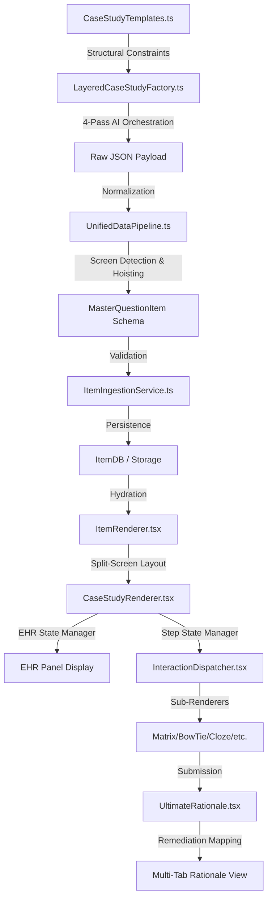

# MASTER CASE STUDY PROTOCOL (Single Source of Truth)

This document defines the strict schema, labeling, and architectural requirements for the NGN Case Study system. All Generation passes, Data Pipelines, and UI Renderers MUST adhere to these exact keys and associations.

## 1. System Architecture Map
The Case Study lifecycle is governed by the following interconnected systems:

## 2. Shared System Files & Requirements

### A. Core Services (Generation & Logic)
| File | Role | Clinical Requirement |
| :--- | :--- | :--- |
| **[LayeredCaseStudyFactory.ts](file:///c:/Users/USER/OneDrive/Desktop/MASTER%20NGN%20GENERATOR-20251218T130148Z-3-001/MASTER%20NGN%20GENERATOR/src/services/LayeredCaseStudyFactory.ts)** | Orchestrator | MUST enforce the 4-pass pipeline: Blueprint -> Skeleton -> Injection -> Auditor. |
| **[CaseStudyTemplates.ts](file:///c:/Users/USER/OneDrive/Desktop/MASTER%20NGN%20GENERATOR-20251218T130148Z-3-001/MASTER%20NGN%20GENERATOR/src/services/CaseStudyTemplates.ts)** | Structural Source | Defines the exact number of screens and distractor ratios per difficulty level. |
| **[RationalePipeline.ts](file:///c:/Users/USER/OneDrive/Desktop/MASTER%20NGN%20GENERATOR-20251218T130148Z-3-001/MASTER%20NGN%20GENERATOR/src/services/RationalePipeline.ts)** | Remediation Logic | Parsed fields MUST map to the 5-tab UI structure (Overview, Option Review, Logic, Strategy, Knowledge). |

### B. Ingestion & Schemas (The Blueprint)
| File | Role | Structural Requirement |
| :--- | :--- | :--- |
| **[master-schema.ts](file:///c:/Users/USER/OneDrive/Desktop/MASTER%20NGN%20GENERATOR-20251218T130148Z-3-001/MASTER%20NGN%20GENERATOR/src/types/master-schema.ts)** | Interface Def | Case Study items MUST adhere to the `screens[]` array and `clinicalData` nested object. |
| **[UnifiedDataPipeline.ts](file:///c:/Users/USER/OneDrive/Desktop/MASTER%20NGN%20GENERATOR-20251218T130148Z-3-001/MASTER%20NGN%20GENERATOR/src/services/UnifiedDataPipeline.ts)** | Data Ingestion | MUST hoist `screens` from `content.screens` or `content.structure.screens` to ensure renderer visibility. |
| **[ItemIngestionService.ts](file:///c:/Users/USER/OneDrive/Desktop/MASTER%20NGN%20GENERATOR-20251218T130148Z-3-001/MASTER%20NGN%20GENERATOR/src/services/ingestion/ItemIngestionService.ts)** | Security/Import | Rejects any JSON missing the `patientInfo` or `history` headers in the Blueprint. |

### C. Rendering Systems (The Interaction)
| File | Role | UI Requirement |
| :--- | :--- | :--- |
| **[ItemRenderer.tsx](file:///c:/Users/USER/OneDrive/Desktop/MASTER%20NGN%20GENERATOR-20251218T130148Z-3-001/MASTER%20NGN%20GENERATOR/src/components/item-types/ItemRenderer.tsx)** | Root Dispatcher | MUST detect `type: 'case-study'` and prevent single-screen fallbacks if `screens` array is present. |
| **[CaseStudyRenderer.tsx](file:///c:/Users/USER/OneDrive/Desktop/MASTER%20NGN%20GENERATOR-20251218T130148Z-3-001/MASTER%20NGN%20GENERATOR/src/components/item-types/renderers/CaseStudyRenderer.tsx)** | EHR & Layout | Controls the split-view. Labels MUST match EHR headers (Nurses Notes, Radiology, etc.). |
| **[InteractionDispatcher.tsx](file:///c:/Users/USER/OneDrive/Desktop/MASTER%20NGN%20GENERATOR-20251218T130148Z-3-001/MASTER%20NGN%20GENERATOR/src/components/item-types/InteractionDispatcher.tsx)** | Sub-Renderer Link | MUST successfully map individual screen `types` to their respective sub-renderers (BowTie, Matrix, etc.). |
| **[UltimateRationale.tsx](file:///c:/Users/USER/OneDrive/Desktop/MASTER%20NGN%20GENERATOR-20251218T130148Z-3-001/MASTER%20NGN%20GENERATOR/src/components/UltimateRationale.tsx)** | Rationale Modal | Standardized tab names: Option Review, Clinical Logic, Strategy, Knowledge. |

## 3. Data Key Mapping (UI Label -> JSON Key)

### EHR Panel (Left)
| UI Label | JSON Key | Structure |
| :--- | :--- | :--- |
| **History & Physical** | `content.clinicalData.historyPhysical` | String (Markdown) |
| **Nurses Notes** | `content.clinicalData.history` | Array<{time, note}> |
| **Vital Signs** | `content.clinicalData.vitals` | Array<{time, bp, hr...}> |
| **Laboratory Results**| `content.clinicalData.labs` | Array<{test, value, unit}> |
| **Orders** | `content.clinicalData.orders` | Array<{drug, dose, route}> |
| **Radiology** | `content.clinicalData.radiology` | Array<{study, findings}> |

### Patient Header (Top Left)
| UI Field | JSON Key | Requirement |
| :--- | :--- | :--- |
| **Code Status** | `patientInfo.codeStatus` | Full Code, DNR, etc. |
| **Isolation** | `patientInfo.isolation` | Standard, Contact, etc. |
| **Allergies** | `patientInfo.allergies` | NKDA or detailed list. |
| **Loc / Provider** | `patientInfo.location` / `provider` | Floor name / Dr. Name. |

## 4. Invariant Rules for Developers
1. **Never Re-Generate Blueprint**: Once Pass 1 is complete, all subsequent screens MUST use the same `clinicalData`.
2. **Schema-First Hoisting**: If the Renderer cannot find screens, check `UnifiedDataPipeline` logic first.
3. **Tab Label Collision**: UI Labels in `CaseStudyRenderer` and `UltimateRationale` MUST be synced manually if protocol changes.
